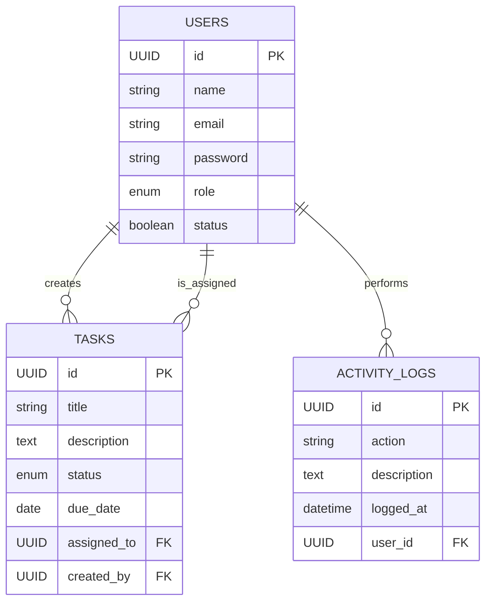
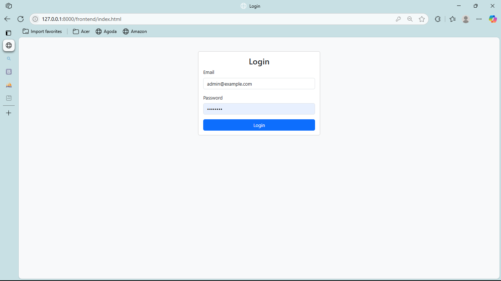
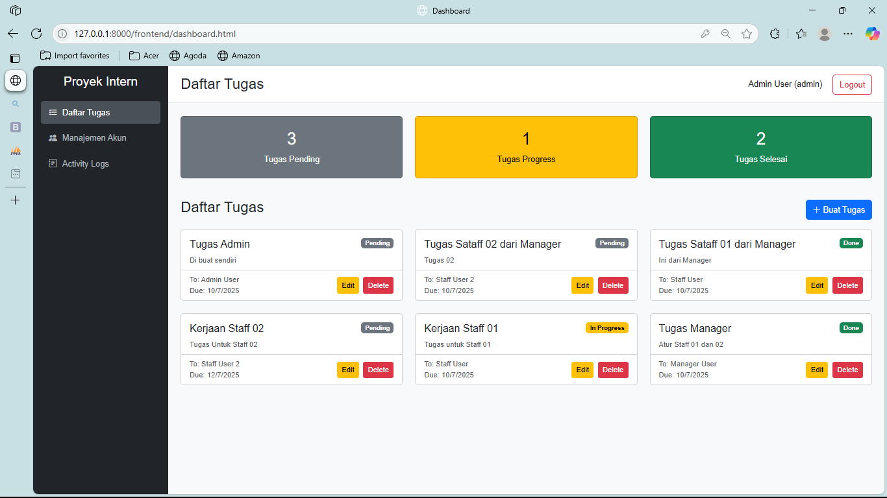
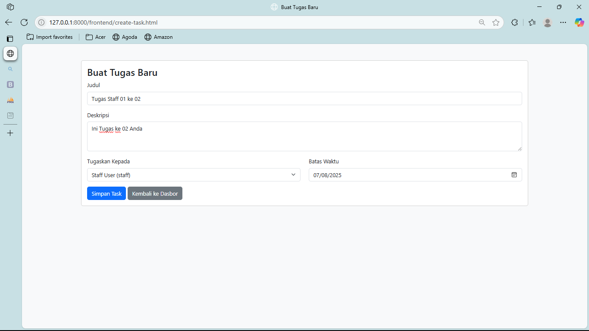
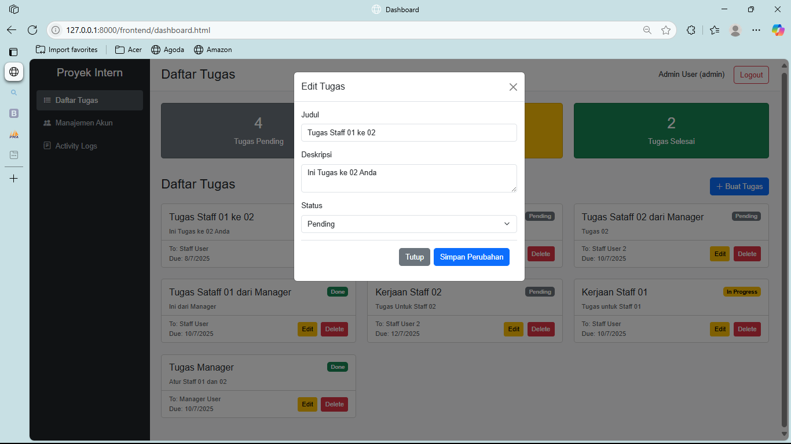
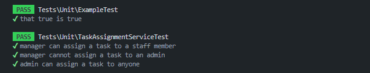

<<<<<<< HEAD
# Sistem Manajemen Tugas dan Pengguna

## Pendahuluan

Dokumen ini menyajikan deskripsi teknis mengenai implementasi sebuah sistem RESTful API yang dirancang untuk manajemen tugas dan pengguna. Sistem ini dilengkapi dengan antarmuka dasbor frontend yang fungsional.

Aplikasi ini dikembangkan sebagai pemenuhan **Tes Evaluasi Kemampuan Fullstack Developer**, dengan penekanan utama pada penerapan **Role-Based Access Control (RBAC)**, **logika bisnis yang terdefinisi**, serta **arsitektur perangkat lunak yang terstruktur**.

---

## 🛠️ Teknologi yang Digunakan

| Komponen     | Teknologi                             |
|--------------|----------------------------------------|
| Backend      | Laravel 11                             |
| Frontend     | HTML, Vanilla JavaScript, Bootstrap 5  |
| Database     | MySQL                                  |
| Autentikasi  | Laravel Sanctum                        |
---

## Fungsionalitas Sistem

### Fungsionalitas Backend

- **Otentikasi API:**  
  Implementasi mekanisme otentikasi yang aman untuk API menggunakan paket Laravel Sanctum.

- **Kontrol Akses Berbasis Peran (RBAC):**  
  Sistem mengimplementasikan tiga peran pengguna: `admin`, `manager`, dan `staff`, masing-masing dengan hak akses yang tergranulasi untuk setiap endpoint.

- **Middleware Kustom:**
  - `CheckUserStatus`: Middleware untuk memvalidasi dan memblokir permintaan dari pengguna dengan status nonaktif.
  - `LogRequest`: Middleware untuk mencatat setiap permintaan API yang masuk ke dalam basis data sebagai log aktivitas.

- **Penjadwal Tugas (Scheduler):**  
  Pemanfaatan Laravel Scheduler untuk mengeksekusi perintah Artisan secara periodik, yang berfungsi untuk memeriksa dan mencatat tugas yang telah melewati batas waktu.

- **Pengujian Perangkat Lunak:**
  - **Feature Tests:** Pengujian yang mencakup verifikasi fungsionalitas endpoint API, proses otentikasi, dan mekanisme otorisasi.
  - **Unit Tests:** Pengujian terisolasi untuk unit-unit logika bisnis yang kritikal.
---
## 📦 Instalasi & Setup

### 1. Clone Repository
```bash
git clone [[URL_REPOSITORY_ANDA]](https://github.com/deviansky/fullstack-intern.git)
cd fullstack-intern
```
### 2. Install Dependencies
```bash
npm install
```
### 3. Setup File Lingkungan (.env)
```bash
cp .env.example .env
php artisan key:generate
```
### 4. Konfigurasi Database
Buka file .env dan sesuaikan bagian berikut:
```bash
DB_CONNECTION=mysql
DB_HOST=127.0.0.1
DB_PORT=3306
DB_DATABASE=db_evaluasi_fullstack
DB_USERNAME=root
DB_PASSWORD=
```
### 5. Jalankan Migrasi & Seeder
```bash
php artisan migrate:fresh --seed
```
## ▶️ Menjalankan Aplikasi
### Jalankan Server Laravel
```bash
php artisan serve
```
---
## Diagram Relasi Entitas (ERD)




---
## 📸 Tangkapan Layar (Screenshot)
Berikut adalah beberapa tangkapan layar dari aplikasi.

* **Halaman Login**
    

* **Dashboard**
    

* **Form Tambah Tugas**
    

* **Fitur Edit Status**
    
  
* **Hasil Test**
  
    
  
  
---
## Kredensial Login
- Admin: admin@example.com / password
- Manager: manager@example.com / password
- Staff: staff@example.com / password
