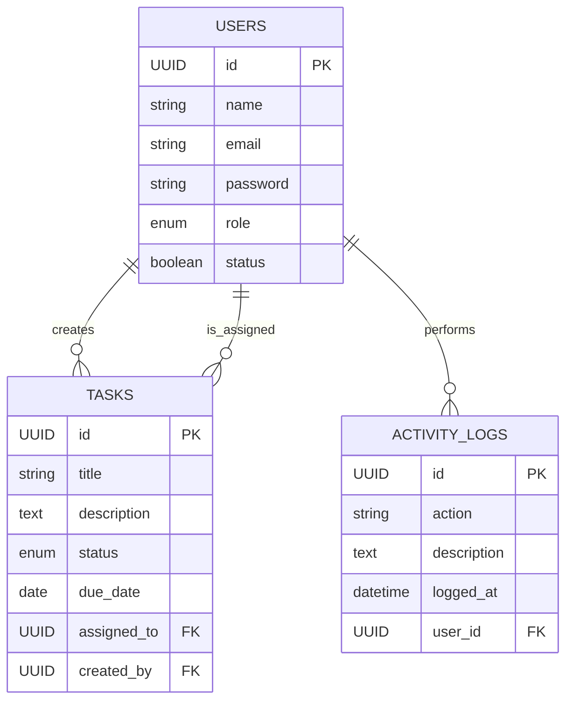

<<<<<<< HEAD
# Sistem Manajemen Tugas dan Pengguna

## Pendahuluan

Dokumen ini menyajikan deskripsi teknis mengenai implementasi sebuah sistem RESTful API yang dirancang untuk manajemen tugas dan pengguna. Sistem ini dilengkapi dengan antarmuka dasbor frontend yang fungsional.

Aplikasi ini dikembangkan sebagai pemenuhan **Tes Evaluasi Kemampuan Fullstack Developer**, dengan penekanan utama pada penerapan **Role-Based Access Control (RBAC)**, **logika bisnis yang terdefinisi**, serta **arsitektur perangkat lunak yang terstruktur**.

---

## 🛠️ Teknologi yang Digunakan

| Komponen     | Teknologi                             |
|--------------|----------------------------------------|
| Backend      | Laravel 11                             |
| Frontend     | HTML, Vanilla JavaScript, Bootstrap 5  |
| Database     | MySQL                                  |
| Autentikasi  | Laravel Sanctum                        |
---

## Fungsionalitas Sistem

### Fungsionalitas Backend

- **Otentikasi API:**  
  Implementasi mekanisme otentikasi yang aman untuk API menggunakan paket Laravel Sanctum.

- **Kontrol Akses Berbasis Peran (RBAC):**  
  Sistem mengimplementasikan tiga peran pengguna: `admin`, `manager`, dan `staff`, masing-masing dengan hak akses yang tergranulasi untuk setiap endpoint.

- **Middleware Kustom:**
  - `CheckUserStatus`: Middleware untuk memvalidasi dan memblokir permintaan dari pengguna dengan status nonaktif.
  - `LogRequest`: Middleware untuk mencatat setiap permintaan API yang masuk ke dalam basis data sebagai log aktivitas.

- **Penjadwal Tugas (Scheduler):**  
  Pemanfaatan Laravel Scheduler untuk mengeksekusi perintah Artisan secara periodik, yang berfungsi untuk memeriksa dan mencatat tugas yang telah melewati batas waktu.

- **Pengujian Perangkat Lunak:**
  - **Feature Tests:** Pengujian yang mencakup verifikasi fungsionalitas endpoint API, proses otentikasi, dan mekanisme otorisasi.
  - **Unit Tests:** Pengujian terisolasi untuk unit-unit logika bisnis yang kritikal.
---
## 📦 Instalasi & Setup

### 1. Clone Repository
```bash
git clone [[URL_REPOSITORY_ANDA]](https://github.com/deviansky/fullstack-intern.git)
cd fullstack-intern
```
### 2. Install Dependencies
```bash
npm install
```
### 3. Setup File Lingkungan (.env)
```bash
cp .env.example .env
php artisan key:generate
```
### 4. Konfigurasi Database
Buka file .env dan sesuaikan bagian berikut:
```bash
DB_CONNECTION=mysql
DB_HOST=127.0.0.1
DB_PORT=3306
DB_DATABASE=db_evaluasi_fullstack
DB_USERNAME=root
DB_PASSWORD=
```
### 5. Jalankan Migrasi & Seeder
```bash
php artisan migrate:fresh --seed
```
## ▶️ Menjalankan Aplikasi
### Jalankan Server Laravel
```bash
php artisan serve
```
---
## Diagram Relasi Entitas (ERD)




---
## 📸 Dokumentasi Antarmuka Aplikasi

### 1. Halaman Login

Antarmuka login memungkinkan pengguna memasukkan email dan password untuk proses otentikasi menggunakan Laravel Sanctum. Jika berhasil login, token disimpan di `localStorage` dan digunakan untuk otorisasi selanjutnya.

**Fitur:**
- Input email dan password
- Validasi input secara instan
- Tampilan clean & responsif

---

### 2. Dasbor dan Manajemen Tugas (CRUD)

Dasbor utama menampilkan daftar tugas dalam bentuk kartu. Informasi yang ditampilkan mencakup:
- Judul tugas
- Deskripsi singkat
- Nama yang ditugaskan
- Batas waktu
- Status tugas (berwarna)

**Tombol Aksi:**
- **Edit**: Menampilkan modal penyuntingan
- **Hapus**: Konfirmasi sebelum menghapus
- Tombol aksi hanya muncul jika peran pengguna memiliki hak akses (`admin`, `manager`, atau `staff`)

---

### 3. Modal Penyuntingan Tugas

Ketika tombol "Edit" diklik, muncul modal yang memungkinkan pengguna memperbarui detail tugas.

**Fitur Modal:**
- Input judul, deskripsi, status, tanggal batas waktu
- Pilih pengguna yang ditugaskan
- Tombol simpan akan memanggil endpoint `PUT /api/tasks/{id}`
- Validasi form sebelum submit

---

### 4. Hasil Eksekusi Tes Otomatis

Setelah menjalankan perintah:
---
## Kredensial Login
- Admin: admin@example.com / password
- Manager: manager@example.com / password
- Staff: staff@example.com / password


=======
<p align="center"><a href="https://laravel.com" target="_blank"></a></p>

<p align="center">
<a href="https://github.com/laravel/framework/actions"></a>
<a href="https://packagist.org/packages/laravel/framework"></a>
<a href="https://packagist.org/packages/laravel/framework"></a>
<a href="https://packagist.org/packages/laravel/framework"></a>
</p>

## About Laravel

Laravel is a web application framework with expressive, elegant syntax. We believe development must be an enjoyable and creative experience to be truly fulfilling. Laravel takes the pain out of development by easing common tasks used in many web projects, such as:

- [Simple, fast routing engine](https://laravel.com/docs/routing).
- [Powerful dependency injection container](https://laravel.com/docs/container).
- Multiple back-ends for [session](https://laravel.com/docs/session) and [cache](https://laravel.com/docs/cache) storage.
- Expressive, intuitive [database ORM](https://laravel.com/docs/eloquent).
- Database agnostic [schema migrations](https://laravel.com/docs/migrations).
- [Robust background job processing](https://laravel.com/docs/queues).
- [Real-time event broadcasting](https://laravel.com/docs/broadcasting).

Laravel is accessible, powerful, and provides tools required for large, robust applications.

## Learning Laravel

Laravel has the most extensive and thorough [documentation](https://laravel.com/docs) and video tutorial library of all modern web application frameworks, making it a breeze to get started with the framework.

You may also try the [Laravel Bootcamp](https://bootcamp.laravel.com), where you will be guided through building a modern Laravel application from scratch.

If you don't feel like reading, [Laracasts](https://laracasts.com) can help. Laracasts contains thousands of video tutorials on a range of topics including Laravel, modern PHP, unit testing, and JavaScript. Boost your skills by digging into our comprehensive video library.

## Laravel Sponsors

We would like to extend our thanks to the following sponsors for funding Laravel development. If you are interested in becoming a sponsor, please visit the [Laravel Partners program](https://partners.laravel.com).

### Premium Partners

- **[Vehikl](https://vehikl.com)**
- **[Tighten Co.](https://tighten.co)**
- **[Kirschbaum Development Group](https://kirschbaumdevelopment.com)**
- **[64 Robots](https://64robots.com)**
- **[Curotec](https://www.curotec.com/services/technologies/laravel)**
- **[DevSquad](https://devsquad.com/hire-laravel-developers)**
- **[Redberry](https://redberry.international/laravel-development)**
- **[Active Logic](https://activelogic.com)**

## Contributing

Thank you for considering contributing to the Laravel framework! The contribution guide can be found in the [Laravel documentation](https://laravel.com/docs/contributions).

## Code of Conduct

In order to ensure that the Laravel community is welcoming to all, please review and abide by the [Code of Conduct](https://laravel.com/docs/contributions#code-of-conduct).

## Security Vulnerabilities

If you discover a security vulnerability within Laravel, please send an e-mail to Taylor Otwell via [taylor@laravel.com](mailto:taylor@laravel.com). All security vulnerabilities will be promptly addressed.

## License

The Laravel framework is open-sourced software licensed under the [MIT license](https://opensource.org/licenses/MIT).
>>>>>>> 16c234c (ss-an)
